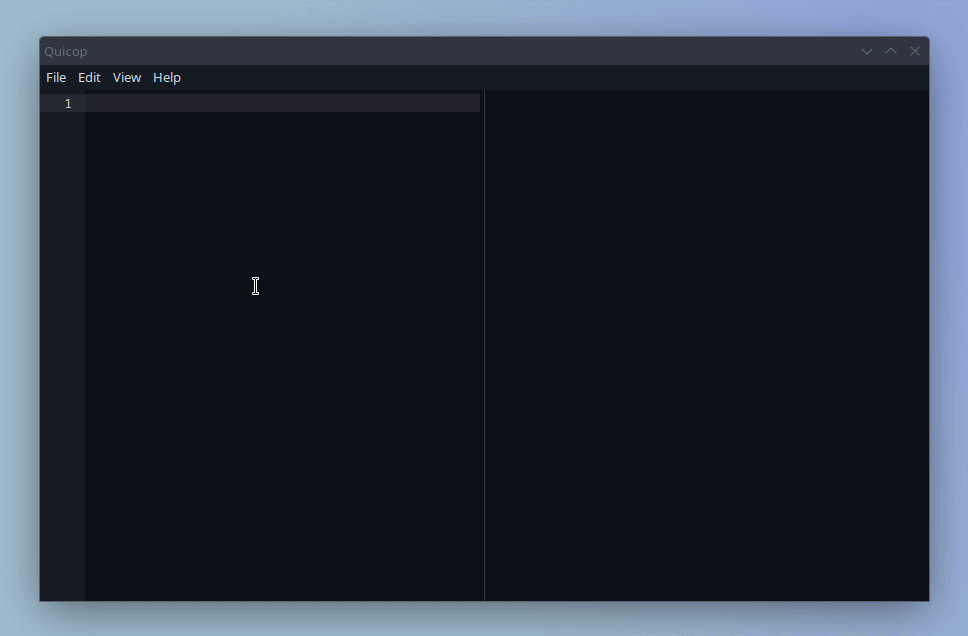
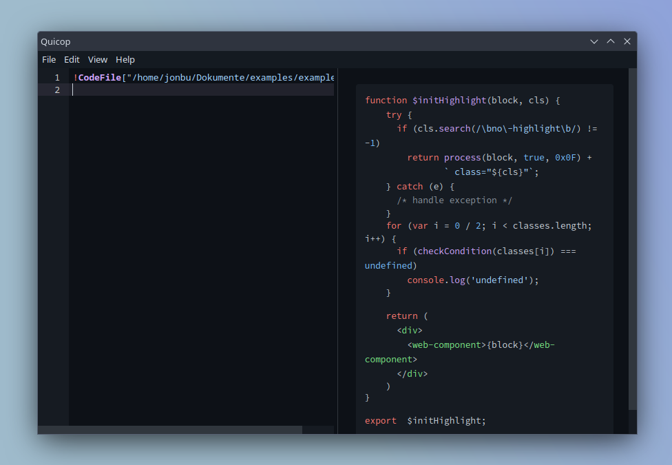
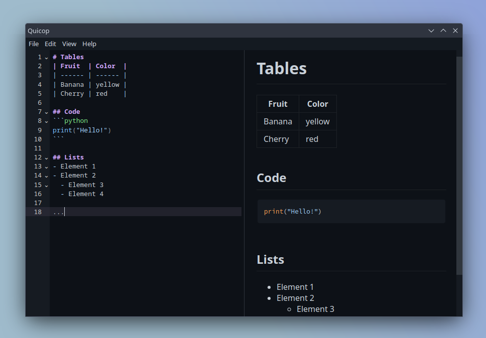
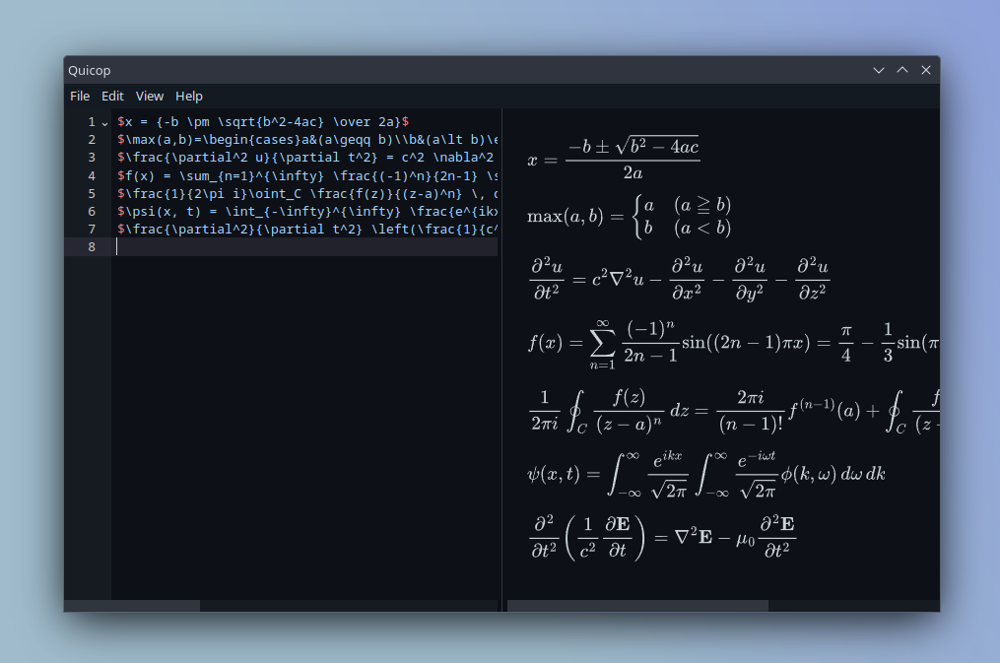
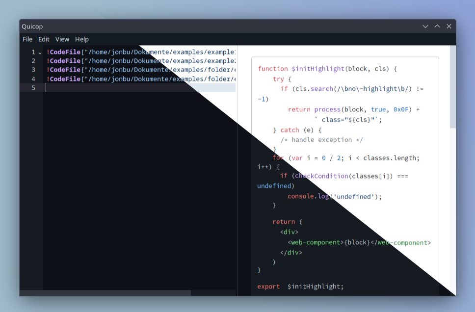

# Quickly convert code files to pdf

Quicop _(**Qui**ck **Co**de **P**rint)_ allows you to quickly import code files (supports 192 programming languages), add some markdown and export the generated pdf.

## Download
New releases are automatically downloaded when you start the application.
- [Windows v1.2.0](https://github.com/JonBunator/Quicop/releases/download/v1.2.0/Quicop-Setup-1.2.0.exe)
- [Linux v1.2.0](https://github.com/JonBunator/Quicop/releases/download/v1.2.0/Quicop-1.2.0.AppImage)

## Features
### Code Files
Embed code files via the `!CodeFile["C:/my-path/file.cs"]` command. Quickly import a bunch of files with `File -> Import Code file folder...`

### Markdown
The basic markdown syntax is supported (headers, tables, code blocks etc.)
You could even use it as a basic markdown editor :)

### MathJax
Display formulas with [MathJax](https://www.mathjax.org/) support.

### Settings
Configure settings under `File -> Settings`. You can for example change from a dark to a light theme.

